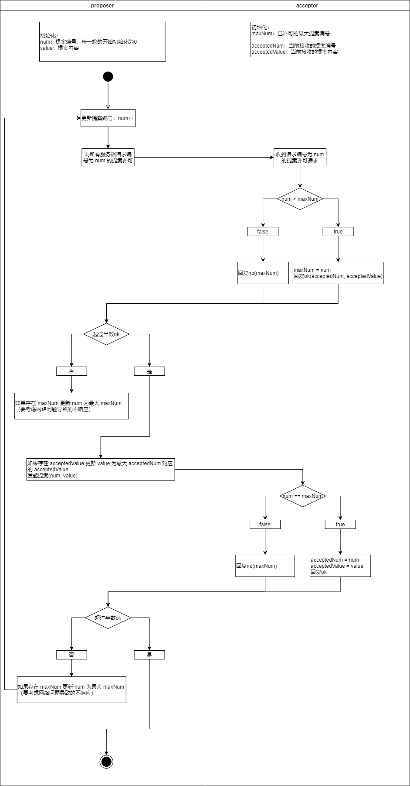

# paxos4j

java版本的paxos算法实现，该算法基于《Paxos made simple》做了适当改动与扩展以支持全局一致性编号以及多轮paxos实例共识。

# 算法说明

角色：

- 提案者
- 接收者

阶段：

1. prepare阶段：提案者向接收者申请第num号提案的许可，如果接收者当前发放过的最大许可maxNum小于num则向提案者发放许可，否则告知提案者当前已发放的最大许可。提案者若收到大多数接收者的允许反馈则挑选现存许可号最大的提案，若没有则使用自己的提案进入阶段2。另外如果提案者没有收到多数的许可，那么提案者应当试图增大自己要申请的许可num为当前所有接收者反馈的最大值加1，然后重启阶段1。
2. accept阶段：提案者提交(num, value)提案，接收者检查num是否为当前发布的最大许可，是则接收，否则拒绝。提案者通过检查提案是否被大多数接收者接收决定当前轮次提案是否结束，若失败则重启阶段1。

